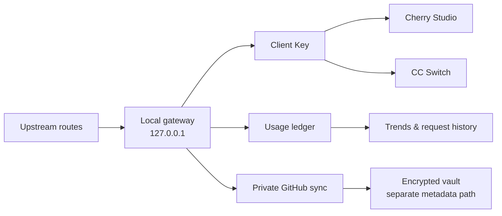

<div align="center">

# Cherry AI Connect

### A local control plane for AI routes, client keys, usage data, and private sync.

**本地 AI 连接中心：统一管理线路、客户端 Key、使用统计与私有云同步。**

<p>
  <a href="https://github.com/BFTwarrior/cherry-ai-connect/releases/latest"></a>
  <a href="#development"></a>
  <a href="https://github.com/BFTwarrior/cherry-ai-connect/blob/main/LICENSE"></a>
  <a href="https://github.com/BFTwarrior/cherry-ai-connect/stargazers"></a>
</p>

<p>
  <a href="https://github.com/BFTwarrior/cherry-ai-connect/releases/latest"><strong>Download for Windows</strong></a>
  · <a href="#why-cherry-ai-connect">Why it exists</a>
  · <a href="#quick-start">Quick start</a>
  · <a href="#documentation">Documentation</a>
</p>


</div>

> **Current release · v1.37** — public GitHub Latest with a Windows x64 installer, Web Demo, updater metadata, and the new Cherry Studio / CC Switch import workflow. Automated checks pass; real-device and real-client acceptance items remain listed honestly below.

## Why Cherry AI Connect?

AI tools become difficult to operate when every client keeps its own endpoint, key, model list, and usage history. Cherry AI Connect gives that layer a home:

| One place | One boundary | One view |
| --- | --- | --- |
| Route multiple upstream providers through one local gateway. | Keep keys, vault data, and the gateway on `127.0.0.1`. | See routes, models, client keys, usage, and sync status together. |

It is designed for people who use Cherry Studio or other OpenAI-compatible clients and want operational control without turning a personal desktop tool into a hosted service.

<details>
<summary><strong>中文辅助说明</strong></summary>

Cherry AI Connect 不是又一个聊天客户端，而是运行在本机的 AI 连接管理层：上游线路、客户端 Key、模型目录、用量统计和 GitHub 私有同步都集中管理。所有本地接口默认只监听 `127.0.0.1`。

</details>

## What you get

### Route control

- Manage multiple upstream routes behind one local OpenAI-compatible gateway.
- Test routes in batches; model refreshes and route checks are queued safely.
- Group and collapse model catalogs by route.
- Support five reasoning levels: `low`, `medium`, `high`, `xhigh`, and `max`.
- Reset the local service using a secure selection from 29,000 candidate ports.

### Client access

- Issue client keys bound to exactly one route.
- Keep client-key names synchronized with route names until a user customizes them.
- Import one key or all enabled keys into Cherry Studio or CC Switch.
- Generate import links in the Electron main process; decrypted client keys never return to the renderer or logs.

### Usage intelligence

- Track lifetime token totals without silently resetting the ledger.
- Explore trends from 24 hours to six months.
- Inspect cache hit rate and live request records.
- Keep request details under a 50 MB local limit while preserving lifetime totals.
- Browse historical request pages independently from the chart time range.

### Private sync and recovery

- Sync encrypted route configuration to the user’s own private GitHub Release.
- Keep usage/request metadata in a separate sync path so a vault failure does not hide local usage.
- Resolve sync conflicts by choosing **Keep Local** or **Use Cloud** before credentials are requested.
- Protect update recovery and data migration with version binding, one-time consumption, and fail-closed startup checks.

### Desktop experience

- Windows tray support, startup launch, close-to-tray behavior, and manual update checks.
- Dark gray, purple, and gold visual system with English-first and Chinese-supported UI.
- Reduced-motion fallback that preserves text and icon clarity.

## The workflow



The key boundary is intentional: clients talk to the local gateway, the gateway owns route selection and accounting, and sync is an explicit protected path rather than an implicit upload of everything on disk.

## Quick start

### 1. Download the current release

**Windows x64 installer:** [Cherry-AI-Connect-Setup-1.37.exe](https://github.com/BFTwarrior/cherry-ai-connect/releases/download/v1.37/Cherry-AI-Connect-Setup-1.37.exe)

| Artifact | Purpose |
| --- | --- |
| [Release page](https://github.com/BFTwarrior/cherry-ai-connect/releases/tag/v1.37) | Notes, checksums, and all release assets |
| [Windows installer](https://github.com/BFTwarrior/cherry-ai-connect/releases/download/v1.37/Cherry-AI-Connect-Setup-1.37.exe) | Windows x64 NSIS package |
| [Web Demo](https://github.com/BFTwarrior/cherry-ai-connect/releases/download/v1.37/Cherry-AI-Connect-Web-Demo-1.37.zip) | Safe browser preview with in-memory demo state |

Verify the installer before running it:

```text
SHA-256  412378416aeff9236c94313c1cdc61a648b34e948e8a64170c4eb05f062e4b18
```

The installer is not commercially code-signed, so Windows SmartScreen may show **Unknown publisher**. Download only from the official Release page.

### 2. Add a route

1. Open **Routes** and create an upstream connection.
2. Enter the upstream endpoint and API key locally.
3. Test the route and refresh its model catalog.
4. Select the required reasoning level.

### 3. Create a client key

1. Open **Client Keys** and create a key bound to one route.
2. Copy the local API endpoint and the generated client key.
3. Or use the card-level **Import to Cherry Studio** / **Import to CC Switch** action.
4. Use the top-level bulk import action when several enabled keys need to be imported.

### 4. Connect a client

Point the compatible client at the local API address shown in the app. Do not expose the address outside the local machine unless you intentionally add your own network boundary.

## Client import design

The v1.37 import flow separates the two visual and security responsibilities:

| Layer | Behavior |
| --- | --- |
| Import button | Uses the primary action effect and a slow glass sweep. |
| Target badge | Uses a static Cherry Studio or CC Switch identity treatment. |
| Single-key import | Appears on each client-key card and launches one target import. |
| Bulk import | Appears once above the list and processes enabled keys one by one. |
| Secret handling | The main process creates the link; the renderer never receives the decrypted key. |

The Web Demo shows layout and interaction states only. It does not launch external clients, call upstream APIs, or access cloud sync.

## Security and data boundaries

### Local by default

- The gateway listens on `127.0.0.1`.
- Upstream API keys are encrypted locally.
- Full client keys, prompts, responses, passwords, recovery codes, and GitHub tokens are not uploaded.
- The packaged app stores runtime data in a sibling data directory outside the installer-owned application folder.

### Cloud sync by explicit choice

GitHub sync is intended for a **private repository owned by you**. Cloud secrets use Argon2id plus AES-256-GCM envelope encryption. Usage/request metadata is compressed but not encrypted; it may include device identifiers, route/client labels, models, endpoints, timestamps, and status.

> A private repository is not the same as encryption. Do not put secrets or personal information into route names, client names, or repository metadata.

### Data layout

```text
<parent>/cherry-ai-connect-data/
├─ browser-cache/
├─ desktop-settings.json
└─ gateway-data/
   ├─ config.json
   ├─ usage.db
   ├─ device.json
   ├─ vault.enc
   └─ sync-state.json
```

Do not delete, move, rename, or overwrite this data directory, a legacy `data/` directory, or update recovery backups until the new installation, usage history, client keys, and sync state have been checked.

## GitHub Cloud Sync

Cherry AI Connect uses two different repository roles:

| Repository | Role |
| --- | --- |
| `BFTwarrior/cherry-ai-connect` | Public source, documentation, and release artifacts |
| `your-account/cherry-ai-connect-sync` | Your private sync repository |

Create a fine-grained GitHub token with the minimum scope:

1. Choose **Only select repositories**.
2. Select only your private sync repository.
3. Grant `Contents: Read and write`.
4. Leave `Metadata: Read-only`.
5. Do not add Actions, Administration, Issues, Pull requests, Secrets, or account-level permissions.
6. Enter the token in **Settings → GitHub Cloud Sync**, then run one immediate sync.

Reference screenshot: [final token permission state](docs/images/github-sync/github-token-final-permissions.png).

<details>
<summary><strong>中文同步要点</strong></summary>

只使用你自己的 GitHub 私有同步仓库；公开源码仓库和同步仓库不是一回事。细粒度令牌只需要指定仓库的 `Contents: Read and write`，`Metadata` 保持只读。同步冲突时可先选择保留本机或使用云端，只有实际解密时才输入保险库凭证。

</details>

## Architecture

```text
Electron main process
  ├─ window / tray / updater / IPC
  ├─ client-import-links.cjs       target-specific import link creation
  └─ runtime-paths + recovery       data-directory and startup protection

React renderer
  ├─ routes / model catalog
  ├─ client keys / import actions
  ├─ usage analytics / request history
  └─ settings / cloud-sync conflict UI

Local gateway
  ├─ OpenAI-compatible routing
  ├─ auth and model catalog
  ├─ usage ledger
  └─ sync-manager → crypto / vault / GitHub provider
```

## Development

Requirements: Node.js and npm. End users do not need Node.js, npm, pnpm, or SQLite after installing the Windows package.

```bash
npm install
npm run check
npm test
npm run renderer:build
npm run web-demo:build
npm run dist
```

Current v1.37 verification:

- `npm test` — 47 tests passed
- `npm run check` — passed
- `npm run renderer:build` — passed
- `npm run web-demo:build` — passed
- `npm run dist` — Windows x64 NSIS build passed
- XMind documentation — 15 maps validated with 0 errors and 0 warnings

The `dist/` directory is generated output and is intentionally excluded from source commits. Release assets are published through GitHub Releases.

## Documentation

### Current docs

- [Document index](产品文档/文档/00-文档索引.txt)
- [User guide](产品文档/文档/01-使用说明.txt)
- [Current acceptance plan](产品文档/文档/流程与规范/05-待验收与后续计划.txt)
- [Serious issue checklist](产品文档/文档/严重问题核查文档.txt)
- [v1.37 import and regression notes](产品文档/文档/20-v1.37客户端导入与回归修复候选.txt)
- [v1.37 acceptance logic map](产品文档/逻辑图/20-v1.37客户端导入与回归验收逻辑图.xmind)
- [Software interface map](产品文档/逻辑图/软件界面逻辑图.xmind)
- [Cloud sync map](产品文档/逻辑图/云同步逻辑图.xmind)

### Historical docs

Older release evidence is preserved under [产品文档/历史](产品文档/历史). Historical records describe their original release and do not replace the current acceptance checklist.

## Current limits and honest status

The following are intentionally not presented as completed just because automated checks pass:

- In-place update and local-data retention on the affected Windows device.
- Real Cherry Studio and CC Switch import confirmation.
- Cherry Studio model-pull behavior on the target client version.
- Particle animation on devices where the effect was previously static.
- Full historical usage pagination on an installed target build.
- Real GitHub sync, conflict recovery, and backup continuity on the target device.

This distinction is part of the project’s reliability boundary: a browser demo and an automated test can prove structure, but not every device-specific runtime outcome.

## Contributing

Issues and focused pull requests are welcome. Please include:

- Reproduction steps and the exact app version.
- Operating system and target client version.
- Sanitized logs or screenshots; never include API keys, tokens, passwords, recovery codes, or private repository data.
- Whether the report affects local data, cloud sync, encryption, update recovery, or only presentation.

For security-sensitive reports, avoid public issue details until the impact has been assessed.

## License

Released under the [MIT License](LICENSE).

<div align="center">

**Local control. Clear boundaries. Better AI operations.**

Cherry AI Connect · v1.37 · Windows x64

</div>
