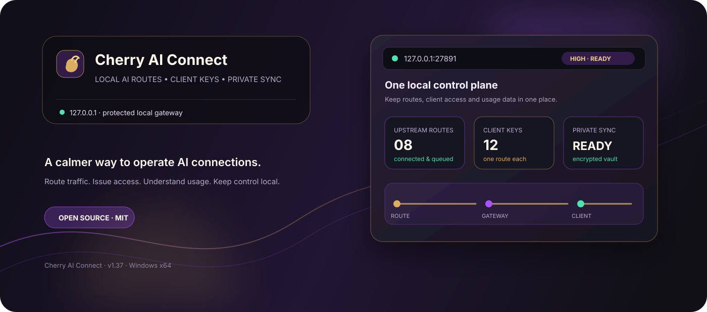
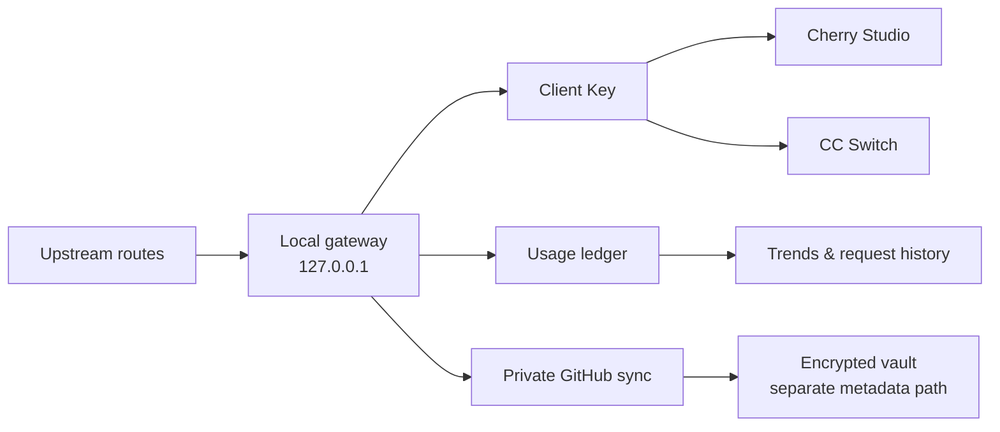
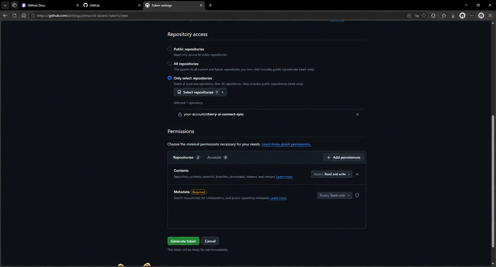

<div align="center">

# Cherry AI Connect

### A local control plane for AI routes, client keys, usage data, and private sync.

**本地 AI 连接中心：统一管理线路、客户端 Key、使用统计与私有云同步。**

<p>
  <a href="https://github.com/BFTwarrior/cherry-ai-connect/releases/latest"></a>
  <a href="https://github.com/BFTwarrior/cherry-ai-connect/blob/main/LICENSE"></a>
  <a href="https://github.com/BFTwarrior/cherry-ai-connect/stargazers"></a>
</p>

<p>
  <a href="https://github.com/BFTwarrior/cherry-ai-connect/releases/latest"><strong>Download for Windows</strong></a>
  · <a href="#why-cherry-ai-connect">Why it exists</a>
  · <a href="#quick-start">Quick start</a>
  · <a href="#documentation">Documentation</a>
</p>



</div>

> **Current release · v1.40.2** — Windows x64 packaging, Web Demo, update metadata, local gateway routing, usage separation, and Cherry Studio / CC Switch import flows are consolidated in this release. The patch keeps an in-progress update visible after leaving and re-entering Settings and adds a prominent homepage shortcut for GitHub API key setup. Device-specific acceptance remains explicitly tracked below.

## Why Cherry AI Connect?

AI tools become difficult to operate when every client keeps its own endpoint, key, model list, and usage history. Cherry AI Connect gives that layer a home:

| One place | One boundary | One view |
| --- | --- | --- |
| Route multiple upstream providers through one local gateway. | Keep keys, vault data, and the gateway on `127.0.0.1`. | See routes, models, client keys, usage, and sync status together. |

It is designed for people who use Cherry Studio or other OpenAI-compatible clients and want operational control without turning a personal desktop tool into a hosted service.

<details>
<summary><strong>中文辅助说明</strong></summary>

Cherry AI Connect 不是又一个聊天客户端，而是运行在本机的 AI 连接管理层：上游线路、客户端 Key、模型目录、用量统计和 GitHub 私有同步都集中管理。所有本地接口默认只监听 `127.0.0.1`。

</details>

## What you get

### Route control

- Manage multiple upstream routes behind one local OpenAI-compatible gateway.
- Test routes in batches; model refreshes and route checks are queued safely.
- Group and collapse model catalogs by route.
- Support five reasoning levels: `low`, `medium`, `high`, `xhigh`, and `max`.
- Reset the local service using a secure selection from 29,000 candidate ports.

### Client access

- Issue client keys bound to exactly one route.
- Keep client-key names synchronized with route names until a user customizes them.
- Import one key or all enabled keys into Cherry Studio or CC Switch.
- Generate import links in the Electron main process; decrypted client keys never return to the renderer or logs.

### Usage intelligence

- Track lifetime token totals without silently resetting the ledger.
- Explore trends from 24 hours to six months.
- Inspect cache hit rate and live request records.
- Keep request details under a 50 MB local limit while preserving lifetime totals.
- Browse historical request pages independently from the chart time range.

### Private sync and recovery

- Sync encrypted route configuration to the user’s own private GitHub Release.
- Keep usage/request metadata in a separate sync path so a vault failure does not hide local usage.
- Relay usage is the current cloud-synced usage ledger. The current unpublished worktree also reads a separate Codex source locally from the loopback service; it is not yet included in cloud sync.
- Resolve sync conflicts by choosing **Keep Local** or **Use Cloud** before credentials are requested.
- Protect update recovery and data migration with version binding, one-time consumption, and fail-closed startup checks.

### Desktop experience

- Windows tray support, startup launch, close-to-tray behavior, and manual update checks.
- Dark gray, purple, and gold visual system with English-first and Chinese-supported UI.
- Reduced-motion fallback that preserves text and icon clarity.

### Current Codex usage boundary

The v1.40 worktree adds a `Codex Official` source that reads only the local `codex-usage` loopback API at `http://127.0.0.1:43189`. It keeps a separate 45 MiB trim target / 50 MiB hard-limit memory cache, never reads `auth.json`, session JSONL, chat content, or keys, and never writes to the relay ledger.

“Official” is a product source label, not a replacement for OpenAI account usage. OpenAI documents `/usage` for account token activity and `/status` for current session, context, and rate limits. This local adapter may be unavailable or incomplete; cloud sync, backup, and cross-device recovery are not implemented for it.

## The workflow



The key boundary is intentional: clients talk to the local gateway, the gateway owns route selection and accounting, and sync is an explicit protected path rather than an implicit upload of everything on disk.

## Quick start

### 1. Download the current release

**Public Windows x64 installer:** [Cherry-AI-Connect-Setup-1.40.2.exe](https://github.com/BFTwarrior/cherry-ai-connect/releases/download/v1.40.2/Cherry-AI-Connect-Setup-1.40.2.exe)

| Artifact | Purpose |
| --- | --- |
| [Release page](https://github.com/BFTwarrior/cherry-ai-connect/releases/tag/v1.40.2) | Notes, checksums, and all release assets |
| [Windows installer](https://github.com/BFTwarrior/cherry-ai-connect/releases/download/v1.40.2/Cherry-AI-Connect-Setup-1.40.2.exe) | Windows x64 NSIS package |
| [Web Demo](https://github.com/BFTwarrior/cherry-ai-connect/releases/download/v1.40.2/Cherry-AI-Connect-Web-Demo-1.40.2.zip) | Safe browser preview with in-memory demo state |

Verify the installer before running it:

```text
SHA-256  8D8B567B144B81D0EC528B4950E7EEB2F8409FD9FCF4C688925FB706CA05AC72
```

The installer is not commercially code-signed, so Windows SmartScreen may show **Unknown publisher**. Download only from the official Release page.

### 2. Add a route

1. Open **Routes** and create an upstream connection.
2. Enter the upstream endpoint and API key locally.
3. Test the route and refresh its model catalog.
4. Select the required reasoning level.

### 3. Create a client key

1. Open **Client Keys** and create a key bound to one route.
2. Copy the local API endpoint and the generated client key.
3. Or use the card-level **Import to Cherry Studio** / **Import to CC Switch** action.
4. Use the top-level bulk import action when several enabled keys need to be imported.

### 4. Connect a client

Point the compatible client at the local API address shown in the app. Do not expose the address outside the local machine unless you intentionally add your own network boundary.

## Security and sync boundary

- The gateway listens on `127.0.0.1`; upstream keys are encrypted locally.
- GitHub sync is opt-in and should use a private repository with only `Contents: Read and write` and `Metadata: Read-only`.
- Prompts, responses, passwords, recovery codes, full client keys, tokens, and complete local paths must not be uploaded.
- The packaged app stores runtime data beside the installer-owned directory. Do not delete or overwrite that data, legacy `data/`, or recovery backups before checking the new installation.

## GitHub Cloud Sync

Cherry AI Connect uses two different repository roles:

| Repository | Role |
| --- | --- |
| `BFTwarrior/cherry-ai-connect` | Public source, documentation, and release artifacts |
| `your-account/cherry-ai-connect-sync` | Your private sync repository |

Create a fine-grained GitHub token with the minimum scope:

1. Choose **Only select repositories**.
2. Select only your private sync repository.
3. Grant `Contents: Read and write`.
4. Leave `Metadata: Read-only`.
5. Do not add Actions, Administration, Issues, Pull requests, Secrets, or account-level permissions.
6. Enter the token in **Settings → GitHub Cloud Sync**, then run one immediate sync.

### Final permission reference



The screenshot is a sanitized reference. Confirm that exactly one private sync repository is selected, `Contents` is `Read and write`, `Metadata` is `Read-only`, and no account-level permission is added. Never publish a real token or private repository data in a screenshot.

### 中文同步要点

公开源码仓库和你自己的私有同步仓库不是一回事。细粒度令牌只需要指定私有同步仓库，`Contents` 设置为 `Read and write`，`Metadata` 保持 `Read-only`。不要添加 Actions、Administration、Issues、Pull requests、Secrets 或账号级权限。

令牌只显示一次，生成后立即复制到软件的 GitHub 云同步设置中；不要放进聊天、截图、Issue 或公开仓库。同步冲突时，可先选择保留本机或使用云端，只有实际解密时才输入保险库凭证。

## Development

Requirements: Node.js and npm. End users do not need Node.js, npm, pnpm, or SQLite after installing the Windows package.

```bash
npm install
npm run check
npm test
npm run renderer:build
npm run web-demo:build
npm run dist
```

Verification scope:

- Public v1.37 baseline: `npm test` 47/47; the public installer uses the SHA-256 shown above.
- v1.40 verification is recorded in [the final delivery report](产品文档/文档/22-v1.40最终版本交付与交叉验证.txt). The published GitHub Latest release is now `v1.40.2`; the update-state and homepage token shortcut verification are recorded in [the v1.40.2 homepage shortcut report](产品文档/文档/24-v1.40.2主页令牌入口.txt). Older assets at the `dist/` root are retained locally and are not part of this release.
- Device update/data retention, real client import, model refresh, historical pagination, particle animation, and real GitHub sync remain field-acceptance items.

The `dist/` directory is generated output and is intentionally excluded from source commits. Release assets are published through GitHub Releases.

## Documentation

### Current docs

- [Document index](产品文档/文档/00-文档索引.txt)
- [User guide](产品文档/文档/01-使用说明.txt)
- [Current acceptance plan](产品文档/文档/流程与规范/05-待验收与后续计划.txt)
- [Serious issue checklist](产品文档/文档/严重问题核查文档.txt)
- [v1.40 final delivery and cross-validation](产品文档/文档/22-v1.40最终版本交付与交叉验证.txt)
- [v1.40.1 update-state fix](产品文档/文档/23-v1.40.1更新状态修复.txt)
- [v1.40.2 homepage token shortcut](产品文档/文档/24-v1.40.2主页令牌入口.txt)
- [v1.37 import and regression notes](产品文档/文档/20-v1.37客户端导入与回归修复候选.txt)
- [v1.37 acceptance logic map](产品文档/逻辑图/20-v1.37客户端导入与回归验收逻辑图.xmind)
- [Software interface map](产品文档/逻辑图/软件界面逻辑图.xmind)
- [Cloud sync map](产品文档/逻辑图/云同步逻辑图.xmind)

### Historical docs

Older release evidence is preserved under [产品文档/历史](产品文档/历史). Historical records describe their original release and do not replace the current acceptance checklist.

## Current limits and honest status

The following are intentionally not presented as completed just because automated checks pass:

- In-place update and local-data retention on the affected Windows device.
- Real Cherry Studio and CC Switch import confirmation.
- Cherry Studio model-pull behavior on the target client version, including the distinction between cached-route availability and unverified catalog discovery.
- Particle animation on devices where the effect was previously static.
- Full historical usage pagination on an installed target build.
- Persistent official Codex usage sync, backup, and cross-device recovery; the current official detail cache is local and memory-bounded only.
- Real GitHub sync, conflict recovery, and backup continuity on the target device.

This distinction is part of the project’s reliability boundary: a browser demo and an automated test can prove structure, but not every device-specific runtime outcome.

## License

Released under the [MIT License](LICENSE).

<div align="center">

**Local control. Clear boundaries. Better AI operations.**

Cherry AI Connect · v1.40.0 candidate · Windows x64

</div>
