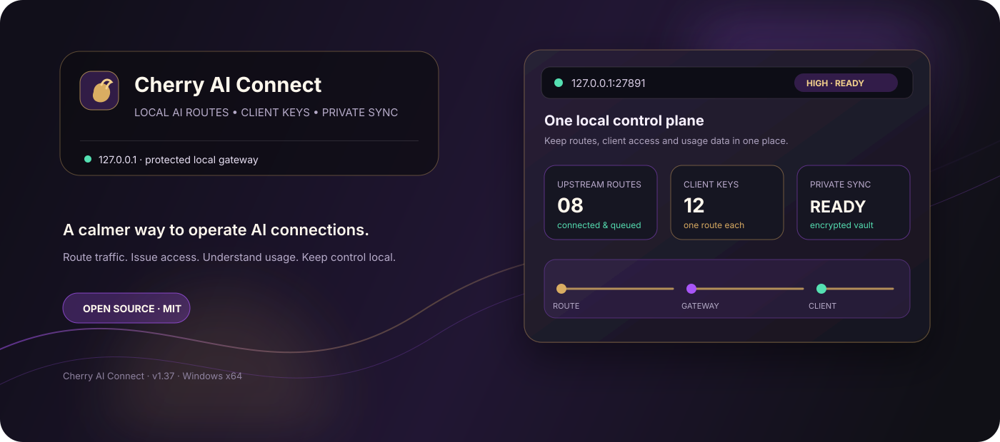
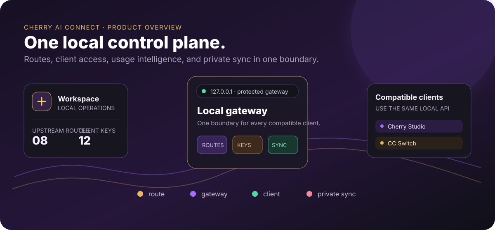
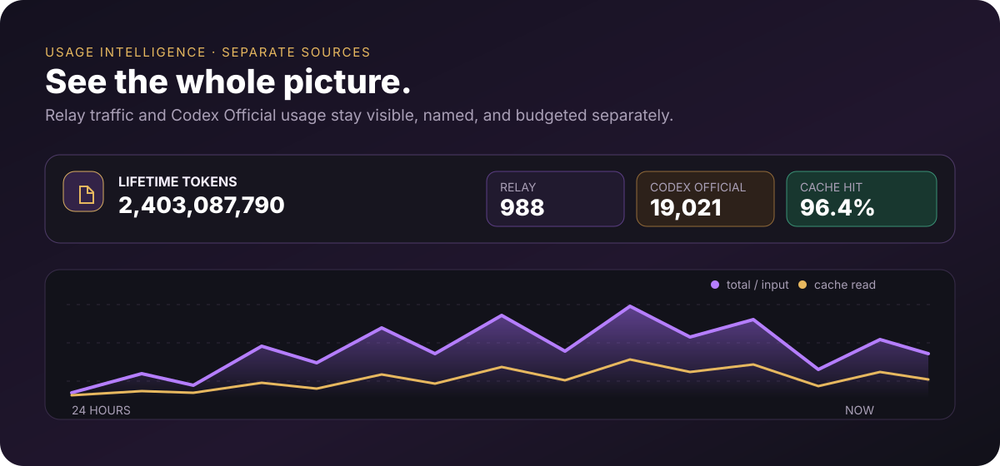
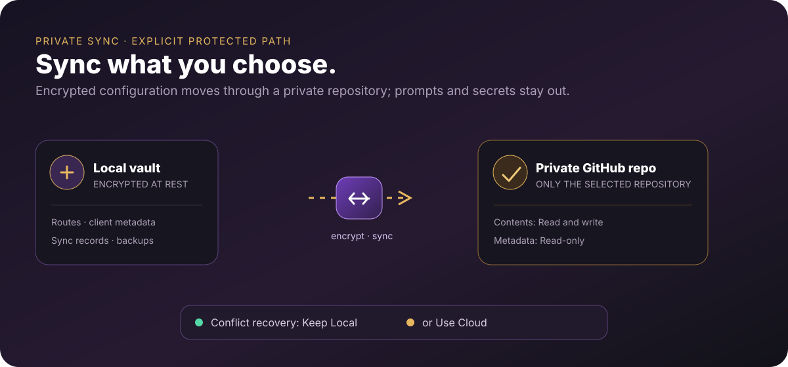
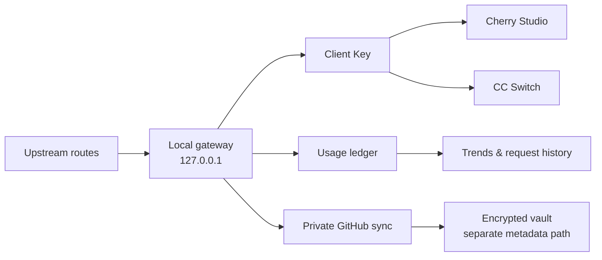
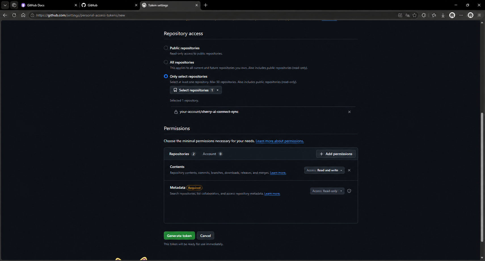

<div align="center">

# Cherry AI Connect

### A local control plane for AI routes, client keys, usage data, and private sync.

**本地 AI 连接中心：统一管理线路、客户端 Key、使用统计与私有云同步。**

<p>
  <a href="https://github.com/BFTwarrior/cherry-ai-connect/releases/latest"></a>
  <a href="https://github.com/BFTwarrior/cherry-ai-connect/blob/main/LICENSE"></a>
  <a href="https://github.com/BFTwarrior/cherry-ai-connect/stargazers"></a>
</p>

<p>
  <a href="https://github.com/BFTwarrior/cherry-ai-connect/releases/latest"><strong>Download for Windows</strong></a>
  · <a href="#why-cherry-ai-connect">Why it exists</a>
  · <a href="#quick-start">Quick start</a>
  · <a href="#documentation">Documentation</a>
</p>



</div>

> **Current release · v1.40.25** — All-source Codex usage history keeps the relay record when a CC Switch or other Codex local observation uniquely matches the same relayed request.

## Product tour

Cherry AI Connect is built around a simple idea: keep the operational boundary local, make every route visible, and make sensitive sync explicit. The visual system below summarizes the current product surface without hiding the important boundaries.

<table>
  <tr>
    <td width="33%" align="center"><br><strong>Local control plane</strong><br><sub>Routes, client keys, compatible clients, and a protected local gateway.</sub></td>
    <td width="33%" align="center"><br><strong>Usage intelligence</strong><br><sub>Lifetime totals, trends, cache reads, request history, and separated sources.</sub></td>
    <td width="33%" align="center"><br><strong>Private sync boundary</strong><br><sub>Encrypted configuration, least-privilege GitHub access, and conflict recovery.</sub></td>
  </tr>
</table>

### What is included in v1.40.25

| Surface | What it does | Boundary worth knowing |
| --- | --- | --- |
| Local gateway | Routes OpenAI-compatible requests across multiple upstream providers. | The default listener stays on `127.0.0.1`. |
| Model catalog | Toggle individual models off or on; disabled models disappear from `/v1/models` and requests receive HTTP 403. | Disabled-model choices are saved locally per device and are not included in cloud sync. |
| Client Keys | Creates one key per route and generates safe import flows for Cherry Studio and CC Switch. | Decrypted upstream keys do not return to the renderer or logs. |
| Usage analytics | Shows relay traffic and `Codex Local Records` usage with source, route, model, status, and history filters. | Relay and Codex local observations use separate accounting sources and separate cache budgets. |
| Private GitHub sync | Stores encrypted configuration in the user’s selected private repository. | Only the selected repository needs `Contents: Read and write` and `Metadata: Read-only`. |
| Update center | Checks release metadata, keeps download progress visible, and preserves local data safeguards. | Device-specific update and data-retention acceptance remains tracked honestly below. |
| Route deletion | Warns that bound client keys will also be removed, then deletes the route and its keys together. | The confirmation is explicit and the result reports how many client keys were removed. |
| Codex usage history | In All sources, a high-confidence matching local Codex observation is folded into its relay record, keeping the relay row as the primary record. | Matching requires the same normalized model, exact input/output token counts, and a unique timestamp match within a duration-aware window; ambiguous or incomplete observations remain separate. |

### The user journey

1. **Connect** — add upstream routes and verify their model catalogs.
2. **Bind** — create client keys that point to exactly one route.
3. **Import** — send the generated local endpoint and key to a compatible client.
4. **Observe** — inspect trends, cache behavior, source-separated usage, and request history.
5. **Protect** — optionally sync encrypted configuration to a private GitHub repository and resolve conflicts explicitly.

## Why Cherry AI Connect?

AI tools become difficult to operate when every client keeps its own endpoint, key, model list, and usage history. Cherry AI Connect gives that layer a home:

| One place | One boundary | One view |
| --- | --- | --- |
| Route multiple upstream providers through one local gateway. | Keep keys, vault data, and the gateway on `127.0.0.1`. | See routes, models, client keys, usage, and sync status together. |

It is designed for people who use Cherry Studio or other OpenAI-compatible clients and want operational control without turning a personal desktop tool into a hosted service.

<details>
<summary><strong>中文辅助说明</strong></summary>

Cherry AI Connect 不是又一个聊天客户端，而是运行在本机的 AI 连接管理层：上游线路、客户端 Key、模型目录、用量统计和 GitHub 私有同步都集中管理。所有本地接口默认只监听 `127.0.0.1`。

</details>

## What you get

### Route control

- Manage multiple upstream routes behind one local OpenAI-compatible gateway.
- Test routes in batches; model refreshes and route checks are queued safely.
- Group and collapse model catalogs by route.
- Support five reasoning levels: `low`, `medium`, `high`, `xhigh`, and `max`.
- Reset the local service using a secure selection from 29,000 candidate ports.

### Client access

- Issue client keys bound to exactly one route.
- Keep client-key names synchronized with route names until a user customizes them.
- Import one key or all enabled keys into Cherry Studio or CC Switch.
- Generate import links in the Electron main process; decrypted client keys never return to the renderer or logs.

### Usage intelligence

- Track lifetime token totals without silently resetting the ledger.
- Explore trends from 24 hours to six months.
- Inspect cache hit rate and live request records.
- Keep request details under a 50 MB local limit while preserving lifetime totals.
- Browse historical request pages independently from the chart time range.
- Keep `Codex Local Records` fixed immediately after `All routes` in the route filter; relay routes remain below it.
- In the All view, choose one totals source (relay by default). Lifetime totals, period metrics and trends never add client observations to gateway observations. History prefers relay rows when a unique high-confidence match exists; ambiguous observations remain separately visible.

### Private sync and recovery

- Sync encrypted route configuration to the user’s own private GitHub Release.
- Keep usage/request metadata in a separate sync path so a vault failure does not hide local usage.
- Relay usage is the current cloud-synced usage ledger. Codex Local Records are read from a separate local loopback service and remain separately named and separately budgeted; they are not included in relay records or cloud sync.
- Resolve sync conflicts by choosing **Keep Local** or **Use Cloud** before credentials are requested.
- Protect update recovery and data migration with version binding, one-time consumption, and fail-closed startup checks.

### Desktop experience

- Windows tray support, startup launch, close-to-tray behavior, and manual update checks.
- Dark gray, purple, and gold visual system with English-first and Chinese-supported UI.
- Reduced-motion fallback that preserves text and icon clarity.

### Current Codex usage boundary

The local Codex adapter keeps `Codex Local Records` as a separate source (internal compatibility ID: `codex-official`) and reads only the local `codex-usage` loopback API at `http://127.0.0.1:43189`. The Windows installer carries the helper and starts it only when that loopback port is not already in use; an existing user-started service is left untouched. The detail table now uses the helper's JSON export, where each row is one model request; it no longer displays the session's cumulative input as if it were one request. The adapter keeps a separate 45 MiB trim target / 50 MiB hard-limit memory cache, never reads `auth.json`, session JSONL, chat content, or keys, and never writes to the relay ledger.

This local feed records Codex client activity, including custom-provider calls; it cannot establish that a request used OpenAI directly. It is not OpenAI account billing. In All-source history, the read-time merge prefers the relay record when the local observation has a unique high-confidence match by normalized model, exact input/output token counts, and a timestamp window based on relay duration. Ambiguous or incomplete rows remain separate, and neither source's stored records are deleted. OpenAI documents `/usage` for account token activity and `/status` for current session, context, and rate limits. This local adapter may be unavailable or incomplete; cloud sync, backup, and cross-device recovery are not implemented for it.

## The workflow


```mermaid
flowchart LR
    A[Upstream routes] --> B[Local gateway<br/>127.0.0.1]
    B --> C[Client Key]
    C --> D[Cherry Studio]
    C --> E[CC Switch]
    B --> F[Usage ledger]
    F --> G[Trends & request history]
    B --> H[Private GitHub sync]
    H --> I[Encrypted vault<br/>separate metadata path]
```

The key boundary is intentional: clients talk to the local gateway, the gateway owns route selection and accounting, and sync is an explicit protected path rather than an implicit upload of everything on disk.

## Quick start

### 1. Download the current release

**Public Windows x64 installer:** [Cherry-AI-Connect-Setup-1.40.25.exe](https://github.com/BFTwarrior/cherry-ai-connect/releases/download/v1.40.25/Cherry-AI-Connect-Setup-1.40.25.exe)

| Artifact | Purpose |
| --- | --- |
| [Release page](https://github.com/BFTwarrior/cherry-ai-connect/releases/tag/v1.40.25) | Notes, checksums, and all release assets |
| [Windows installer](https://github.com/BFTwarrior/cherry-ai-connect/releases/download/v1.40.25/Cherry-AI-Connect-Setup-1.40.25.exe) | Windows x64 NSIS package; the standard filename and checksum support the in-app updater |
| [Web Demo](https://github.com/BFTwarrior/cherry-ai-connect/releases/download/v1.40.25/Cherry-AI-Connect-Web-Demo-1.40.25.zip) | Safe browser preview with in-memory demo state |

Verify the installer before running it:

```text
SHA-256  913FEFECD4D66BF0C9DF3193C00D0C7A389C50533A56818108010597BCFED1AA
```

The installer is not commercially code-signed, so Windows SmartScreen may show **Unknown publisher**. Download only from the official Release page.

### 2. Add a route

1. Open **Routes** and create an upstream connection.
2. Enter the upstream endpoint and API key locally.
3. Test the route and refresh its model catalog.
4. Select the required reasoning level.

### 3. Create a client key

1. Open **Client Keys** and create a key bound to one route.
2. Copy the local API endpoint and the generated client key.
3. Or use the card-level **Import to Cherry Studio** / **Import to CC Switch** action.
4. Use the top-level bulk import action when several enabled keys need to be imported.

### 4. Connect a client

Point the compatible client at the local API address shown in the app. Do not expose the address outside the local machine unless you intentionally add your own network boundary.

## Security and sync boundary

- The gateway listens on `127.0.0.1`; upstream keys are encrypted locally.
- GitHub sync is opt-in and should use a private repository with only `Contents: Read and write` and `Metadata: Read-only`.
- Prompts, responses, passwords, recovery codes, full client keys, tokens, and complete local paths must not be uploaded.
- The packaged app stores runtime data beside the installer-owned directory. Do not delete or overwrite that data, legacy `data/`, or recovery backups before checking the new installation.

## GitHub Cloud Sync

Cherry AI Connect uses two different repository roles:

| Repository | Role |
| --- | --- |
| `BFTwarrior/cherry-ai-connect` | Public source, documentation, and release artifacts |
| `your-account/cherry-ai-connect-sync` | Your private sync repository |

Create a fine-grained GitHub token with the minimum scope:

1. Choose **Only select repositories**.
2. Select only your private sync repository.
3. Grant `Contents: Read and write`.
4. Leave `Metadata: Read-only`.
5. Do not add Actions, Administration, Issues, Pull requests, Secrets, or account-level permissions.
6. Enter the token in **Settings → GitHub Cloud Sync**, then run one immediate sync.

### Final permission reference



The screenshot is a sanitized reference. Confirm that exactly one private sync repository is selected, `Contents` is `Read and write`, `Metadata` is `Read-only`, and no account-level permission is added. Never publish a real token or private repository data in a screenshot.

### 中文同步要点

公开源码仓库和你自己的私有同步仓库不是一回事。细粒度令牌只需要指定私有同步仓库，`Contents` 设置为 `Read and write`，`Metadata` 保持 `Read-only`。不要添加 Actions、Administration、Issues、Pull requests、Secrets 或账号级权限。

令牌只显示一次，生成后立即复制到软件的 GitHub 云同步设置中；不要放进聊天、截图、Issue 或公开仓库。同步逻辑自动合并最新记录，不再选择保留本机或使用云端。客户端 Key 条目与顺序使用 GitHub Token 同步，实际 Key 在各设备本地生成；中转站 Key/地址须经保险库密码或恢复码认证后加密同步。本机修改去重触发同步，其他设备每分钟检查一次。

<p align="center">
  <a href="https://github.com/settings/personal-access-tokens/new">🇨🇳 创建 GitHub API 令牌</a>
  &nbsp; · &nbsp;
  <a href="https://github.com/settings/personal-access-tokens/new">🇬🇧 Create a GitHub API Token</a>
</p>

## Development

Requirements: Node.js and npm. End users do not need Node.js, npm, pnpm, or SQLite after installing the Windows package.

```bash
npm install
npm run check
npm test
npm run renderer:build
npm run web-demo:build
npm run dist
```

Verification scope:

- v1.40.23: Adds local per-model enable/disable controls and gateway enforcement; disabled models are omitted from the model catalog and rejected with HTTP 403. Also fixes disabled-state feedback and keeps compact usage-history columns aligned. TypeScript, renderer, full regression, and Windows x64 installer verification passed; installed-device acceptance remains pending.
- v1.40.24: Route deletion removes bound client keys with an explicit warning and reports the deletion count. TypeScript, regression, renderer, and Windows x64 installer verification are recorded in the version report; installed-device acceptance remains pending.
- v1.40.25: All-source usage history prefers a relay record over a uniquely matched Codex local observation using normalized model, exact input/output tokens, and a duration-aware timestamp window. Ambiguous or incomplete pairs remain visible. TypeScript and renderer builds passed; the Windows x64 NSIS installer passed the 100 MB size gate at 99,937,116 bytes (SHA-256 `913FEFECD4D66BF0C9DF3193C00D0C7A389C50533A56818108010597BCFED1AA`). Web Demo packaged successfully. No automated tests were run; installed-device acceptance remains pending.
- v1.40.22: Aligns compact usage-history reasoning and status columns; centers the reasoning-level badge. TypeScript, renderer, and Windows x64 NSIS builds passed. No automated tests were added or run for this UI alignment correction.
- v1.40.21: Usage totals now use one selected source while All history preserves both observations. Fourteen source-merge regressions and one gateway usage test passed; TypeScript, renderer, and Windows x64 NSIS builds passed.
- v1.40.20: Four changed runtime files passed syntax checks; TypeScript, renderer and Windows installer builds passed. Tombstone acknowledgements use the committed snapshot outbox IDs; newly arriving usage remains pending until later synchronization and requires a complete verified local backup before installer handoff. No automated tests were added or run. Actual device update, backup recovery and concurrent sync acceptance remain pending.

- v1.40.19: TypeScript, renderer and Windows installer builds passed. The sidebar and update card take their version from package.json; the packaged renderer and application metadata both declare 1.40.19. No automated tests were added or run for this small display correction; installed-device update acceptance remains pending.

- v1.40.18: TypeScript, renderer and Windows installer builds passed. Unfinished GitHub manifest uploads are excluded from committed-backup reads; 404 downloads recheck metadata and retry uploaded assets once. Normal transport and integrity failures remain protective stops. No automated tests were added or run for this patch; real-device sync recovery and concurrent-device acceptance remain pending.

- v1.40.12: Full isolated regression 132/132 passed. Coverage includes cache isolation, ETag refresh, rate-limit cooldown and restart, manifest/GC read failures, offline update pause, pending data backup and corrupt-copy rejection. Installed-device update acceptance remains pending.
- v1.40.11: TypeScript, renderer and Windows installer builds passed; full isolated regression 118/118 passed, including completion-time preservation, persisted state, failure, restart, retry and no-op rounds. Real-device built-in update acceptance is pending user testing.

- Public v1.37 baseline: `npm test` 47/47; the public installer uses the SHA-256 shown above.
- v1.40 verification is recorded in [the final delivery report](产品文档/文档/22-v1.40最终版本交付与交叉验证.txt). The v1.40.2 fixes and verification scope are recorded in [the v1.40.2 critical-fixes report](产品文档/文档/24-v1.40.2关键修复.txt). Older assets at the `dist/` root are retained locally and are not part of this release.
- Device update/data retention, real client import, model refresh, historical pagination, particle animation, and real GitHub sync remain field-acceptance items.

The `dist/` directory is generated output and is intentionally excluded from source commits. Release assets are published through GitHub Releases.

## Documentation

### Current docs

- [Document index](产品文档/文档/00-文档索引.txt)
- [User guide](产品文档/文档/01-使用说明.txt)
- [Current acceptance plan](产品文档/文档/流程与规范/05-待验收与后续计划.txt)
- [Serious issue checklist](产品文档/文档/严重问题核查文档.txt)
- [v1.40.2 usage analytics issue review](产品文档/文档/25-v1.40.2新增问题-使用统计核查.txt)
- [v1.40.3 fixes and release record](产品文档/文档/26-v1.40.3修复与发布记录.txt)
- [v1.40 final delivery and cross-validation](产品文档/文档/22-v1.40最终版本交付与交叉验证.txt)
- [v1.40.1 update-state fix (historical)](产品文档/文档/23-v1.40.1更新状态修复.txt)
- [v1.40.2 critical fixes](产品文档/文档/24-v1.40.2关键修复.txt)
- [v1.40.2 critical-fix logic map](产品文档/逻辑图/24-v1.40.2关键修复逻辑图.xmind)
- [v1.37 import and regression notes](产品文档/文档/20-v1.37客户端导入与回归修复候选.txt)
- [v1.37 acceptance logic map](产品文档/逻辑图/20-v1.37客户端导入与回归验收逻辑图.xmind)
- [Software interface map](产品文档/逻辑图/软件界面逻辑图.xmind)
- [Cloud sync map](产品文档/逻辑图/云同步逻辑图.xmind)

### Historical docs

Older release evidence is preserved under [产品文档/历史](产品文档/历史). Historical records describe their original release and do not replace the current acceptance checklist.

## Current limits and honest status

The following are intentionally not presented as completed just because automated checks pass:

- In-place update and local-data retention on the affected Windows device.
- Real Cherry Studio and CC Switch import confirmation.
- Cherry Studio model-pull behavior on the target client version, including the compatibility placeholder used when a route is usable but its upstream model catalog is unavailable.
- Particle animation on devices where the effect was previously static.
- Full historical usage pagination on an installed target build.
- Persistent official Codex usage sync, backup, and cross-device recovery; the current official detail cache is local and memory-bounded only.
- Real GitHub sync, conflict recovery, and backup continuity on the target device.

This distinction is part of the project’s reliability boundary: a browser demo and an automated test can prove structure, but not every device-specific runtime outcome.

## License

Released under the [MIT License](LICENSE).

<div align="center">

**Local control. Clear boundaries. Better AI operations.**

Cherry AI Connect · v1.40.25 · Windows x64

</div>
